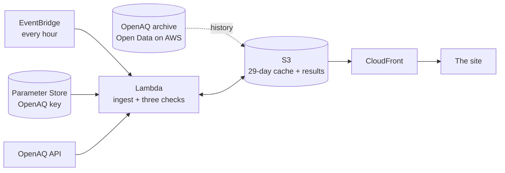

# Ground Truth

**Which of Delhi's air-quality numbers can you trust?** Every monitor in Delhi and the NCR, checked every hour against the monitors around it, its own past and physics, with a plain answer and the evidence behind it.

Environmental Hacks 2026 · Air track · team thegoodengineers


**Live site:** _CloudFront URL after `make deploy`_ · **Demo video:** _YouTube link on submission_ · **Writeup:** [docs/submission.md](docs/submission.md)

## The problem

A school principal in East Delhi checks the air at 7:30 before deciding whether assembly stays outdoors. The nearest monitor says the air is fine. But is that monitor working? In October 2025, water tankers were filmed near a Delhi monitor. A published number tells you nothing about the station behind it.

## What it does

Every hour, each monitor gets three checks:

| Check | Question | Catches |
|---|---|---|
| **Physics** | Can this reading even be real? | Fine dust (PM2.5) reported bigger than all dust (PM10), values out of range, sensors stuck on one number |
| **Neighbours** | Does it agree with the four monitors around it? | A daytime drift far beyond what normal daytime air mixing explains |
| **History** | Has it suddenly changed? | The last 7 days against the 3 weeks before, for dust and humidity |

Each monitor then gets one answer: **agrees with neighbours**, **worth a look** or **doesn't add up**. When a monitor is in doubt, the site shows what the four monitors around it read right now, so the person has a number to act on.

The site explains itself in ten seconds with one real monitor, and then lets you explore Delhi in 3D. Each monitor is a mast whose column is as tall as its PM2.5 reading, with smog that thickens where the air is worse.

## What we found

- **Impossible readings are common at a few monitors.** In Oct-Nov 2025, Vikas Sadan (Gurugram) reported more fine dust than total dust in 31% of hours.
- **The stations in the news don't stand out.** We tested whether the monitors named in the October 2025 reports show a spraying pattern. On a method fixed before looking, Anand Vihar ranked 6th and Jahangirpuri 13th of 38. We say so on the site: a flag means the numbers don't add up, not that anyone cheated.

The full analysis is in [spike/RESULTS.md](spike/RESULTS.md).

## Proof

- **We tried to fool it 30 times. It caught all 30.** In real November 2025 data, we lowered one quiet monitor's daytime PM10 by 40%, one monitor at a time. Every one was flagged, and only 3 other monitors were wrongly flagged across all 30 runs.
- **Every day of October and November 2025, scored as the live site would have** ([docs/VALIDATION.md](docs/VALIDATION.md), made by `src/validate.py`). About 1 in 5 monitors was flagged on a typical day, most of them by the physics check: readings that can't be real. The neighbour and history checks flagged about 3 monitors a day between them. A planted daytime drop of 30% was flagged 29 times out of 30, a drop of 40% every time, and a drop of 20% 10 times out of 30.
- **62 automated tests** run on every change (`make test`, GitHub Actions). They cover the planted anomaly, physics, the data contract, the wording (no output ever says "fake", "tampered" or "sprayed"), silent monitors, the CPCB AQI bands, and the hourly ingest against a fake API, including OpenAQ failures.

## Built on AWS



- **EventBridge** starts the check every hour.
- **Lambda** (Python 3.11) reads new readings from OpenAQ, with the key in **SSM Parameter Store**, runs the three checks and writes JSON to **S3**.
- **CloudFront** serves the site and the data from a private bucket.
- Everything is one **AWS SAM** template ([template.yaml](template.yaml)), in us-east-1 next to the public OpenAQ archive on Open Data on AWS.

## Run it

```
make setup        # dev tools: pytest, ruff, cfn-lint
make local        # the site on http://localhost:8000 with real sample data, no AWS needed
make test lint    # tests and linters
make deploy       # with the groundtruth AWS profile: stack + site
make seed && make run   # 28 days of history into the cache, then the first hourly run
```

Open `http://localhost:8000/?demo=1` for the self-playing tour.

## Repo

| Folder | What's in it |
|---|---|
| [site/](site/) | The website: landing, explainer, 3D Delhi (three.js), station panel |
| [src/](src/) | Backfill, scorer and the hourly ingest Lambda (pure Python, no dependencies) |
| [tests/](tests/) | 62 tests on real data, plus browser smoke tests |
| [spike/](spike/) | The data analysis the checks are built on |
| [docs/](docs/) | Plan, stack and data contract, tasks, learnings, submission |
| [sample/](sample/) | Real scorer output to 4 Oct 2026 |
| [video/](video/) | Demo video script and narration |

## Data and credits

- Air-quality readings: CPCB and DPCC monitors via [OpenAQ](https://openaq.org).
- Delhi ward and boundary data: [DataMeet](https://github.com/datameet/Municipal_Spatial_Data) (CC BY-SA 2.5 India); our simplified copy in `site/geo/` is shared under the same licence.
- [three.js](https://threejs.org) and [Chart.js](https://www.chartjs.org) (MIT); Geist and Geist Mono fonts (SIL Open Font License).

## Team

Chirag ([@Chirag6722](https://github.com/Chirag6722)), Abhijeet ([@thegoodengineer](https://github.com/thegoodengineer)), Bhumika ([@Bhumika-1432006](https://github.com/Bhumika-1432006)), Ayush ([@AyushVUpadhye](https://github.com/AyushVUpadhye)).
