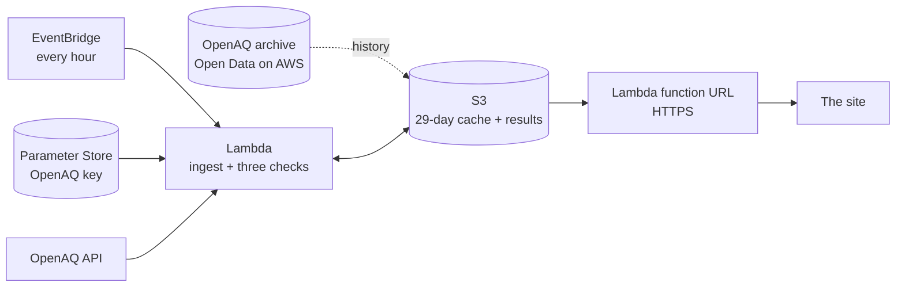

# Ground Truth

**Which of Delhi's air-quality numbers can you trust?** Every monitor in Delhi and the NCR, checked every hour against the monitors around it, its own past and physics, with a plain answer and the evidence behind it.

Environmental Hacks 2026 · Air track · team thegoodengineers


**Live site:** [zsx5rsh4vklo266budro23qama0cpbpi.lambda-url.us-east-1.on.aws](https://zsx5rsh4vklo266budro23qama0cpbpi.lambda-url.us-east-1.on.aws/) · **Demo video:** _YouTube link on submission_ · **Writeup:** [docs/submission.md](docs/submission.md)

## The problem

A school principal in East Delhi checks the air at 7:30 before deciding whether assembly stays outdoors. The nearest monitor says the air is fine. But is that monitor working? In October 2025, water tankers were filmed near a Delhi monitor. A published number tells you nothing about the station behind it.

## What it does

Every hour, each monitor gets three checks:

| Check | Question | Catches |
|---|---|---|
| **Physics** | Can this reading even be real? | Fine dust (PM2.5) reported bigger than all dust (PM10), values out of range, sensors stuck on one number |
| **Neighbours** | Does it agree with the four monitors around it? | A daytime drift far beyond what normal daytime air mixing explains |
| **History** | Has it suddenly changed? | The last 7 days against the 3 weeks before, for dust and humidity |

Each monitor then gets one answer: **agrees with neighbours**, **worth a look** or **doesn't add up**. One click on "find the monitor near me" asks the browser where you are and opens the nearest monitor with its answer and the number to use. Every panel has a **share card** (a 1200x630 picture of the answer, drawn in the browser, for WhatsApp or a slide) and an **embed** snippet: `embed.html?station=235` is a small badge a newsroom or a school can frame on its own page, kept up every hour. Every monitor also carries its last 28 days of answers, one a day, so a reporter can link to `#235/history` and see how often a station has failed; the live map says which monitors changed their answer since yesterday, the proof section charts the whole month city-wide, and `data/changes.xml` is an Atom feed of every change, to subscribe to. When a monitor is in doubt, the site shows what the four monitors around it read right now, so the person has a number to act on.

The site explains itself in ten seconds with one real monitor, and then lets you explore Delhi in 3D. Each monitor is a mast whose column is as tall as its PM2.5 reading, with smog that thickens where the air is worse.

## Beyond the checks

- **Find the monitor near me**: one click, the nearest monitor with a reading, its answer and the number to use.
- **A month behind every answer**: every day of the last 28, scored as the live check scores it, as a strip in every panel (`#235/history`), a city-wide chart under the proof, and `data/changes.xml`, an Atom feed of every monitor that changed its answer.
- **Share card and embed**: a picture of the answer for WhatsApp or a slide, and `embed.html?station=235`, a badge a newsroom or a school can frame.
- **Context, not blame**: the wind and the mixing height (Open-Meteo), farm fires on the horizon (NASA FIRMS, with a key), and a panel note when a whole area rose together, which is what smoke does.
- **The real ground**: the 3D city stands on a Sentinel-2 image of Delhi from the Registry of Open Data on AWS, lit by the real hour.

## What we found

- **Impossible readings are common at a few monitors.** In Oct-Nov 2025, Vikas Sadan (Gurugram) reported more fine dust than total dust in 31% of hours.
- **The stations in the news don't stand out.** We tested whether the monitors named in the October 2025 reports show a spraying pattern. On a method fixed before looking, Anand Vihar ranked 6th and Jahangirpuri 13th of 38. We say so on the site: a flag means the numbers don't add up, not that anyone cheated.

The full analysis is in [spike/RESULTS.md](spike/RESULTS.md).

## Proof

- **We tried to fool it 30 times. It caught all 30.** In real November 2025 data, we lowered one quiet monitor's daytime PM10 by 40%, one monitor at a time. Every one was flagged, and only 3 other monitors were wrongly flagged across all 30 runs.
- **Every day of October and November 2025, scored as the live site would have** ([docs/VALIDATION.md](docs/VALIDATION.md), made by `src/validate.py`). About 1 in 5 monitors was flagged on a typical day, most of them by the physics check: readings that can't be real. The neighbour and history checks flagged about 3 monitors a day between them. A planted daytime drop of 30% was flagged 29 times out of 30, a drop of 40% every time, and a drop of 20% 10 times out of 30.
- **93 automated tests** run on every change (`make test`, GitHub Actions). They cover the planted anomaly, physics, the data contract, the wording (no output ever says "fake", "tampered" or "sprayed"), silent monitors, the CPCB AQI bands, the hourly ingest against a fake API, including OpenAQ failures, the HTTPS front with its security headers, and the Hindi page staying in step with the English one.

## Built on AWS



- **EventBridge** starts the check every hour.
- **Lambda** (Python 3.11) reads new readings from OpenAQ, with the key in **SSM Parameter Store**, runs the three checks and writes JSON to **S3**.
- **CloudFront** serves the site and the data from a private bucket, with a response headers policy (CSP, HSTS, nosniff). Until AWS Support verifies this account for CloudFront, a second small **Lambda function URL** serves the bucket over HTTPS with the same headers, and the bucket's **S3 website endpoint** is the HTTP fallback (`UseCloudFront` in the template flips it).
- **CloudWatch** alarms (Lambda errors, a run that stopped early, data older than 3 hours) and a **Budgets** alarm ($5 a month) go to an **SNS** email, and one **CloudWatch dashboard** (`DashboardUrl` in the stack outputs) shows data age, every run (with a table of the last 24), how many monitors got each answer every hour, the site's traffic and throttles, and the alarms on one screen. What to do when one fires: [docs/RUNBOOK.md](docs/RUNBOOK.md).
- A merge to `main` deploys through **GitHub Actions with OIDC**: no AWS keys stored anywhere ([infra/github-oidc.yaml](infra/github-oidc.yaml), [.github/workflows/deploy.yml](.github/workflows/deploy.yml)).
- Everything is one **AWS SAM** template ([template.yaml](template.yaml)), in us-east-1 next to the public OpenAQ archive on Open Data on AWS.

### Cost

Every resource is tagged `project=ground-truth`, and a $5/month budget on that tag emails at 80%.

| What | A month | Why |
|---|---|---|
| Lambda, the hourly check | 720 runs × about 5 min × 512 MB on arm64 = about 110,000 GB-seconds | about $1.45 at list price; $0 inside the free tier's 400,000 GB-s |
| Lambda, serving the site | about 10 requests a page view, a few ms each | cents |
| S3 | about 10 MB stored, about 45,000 writes, reads | about $0.25 |
| CloudWatch, SNS, Budgets | 2 custom metrics, 3 alarms, 1 topic, 1 budget | $0 inside the free tier (10 metrics, 10 alarms, 2 budgets), else about $1 |
| **Total** | | **about $0.30 a month inside the free tier, about $3 without it** |

Measured: the stack went live on 9 Oct 2026 at 02:20 IST. The project tag becomes filterable in Cost Explorer about a day after the first tagged usage; the measured 48-hour number goes here when it is readable.

## Run it

```
make setup        # dev tools: pytest, ruff, cfn-lint
make local        # the site on http://localhost:8000 with real sample data, no AWS needed
make test lint    # tests and linters
make deploy ALERT_EMAIL=you@example.com   # with the groundtruth AWS profile: stack + site
make sample       # until the first live run: publish the committed sample as data/
make seed && make run   # 28 days of history into the cache, then the first hourly run
make url          # the HTTPS site and the HTTP website endpoint
```

The OpenAQ key lives in SSM Parameter Store as `/ground-truth/openaq-key` (a SecureString, put there by hand once). Set `USE_CLOUDFRONT=true` once the account is verified for CloudFront.

Open `http://localhost:8000/?demo=1` for the self-playing tour.

## Repo

| Folder | What's in it |
|---|---|
| [site/](site/) | The website: the home page (story, 3D Delhi in three.js, station panel, proof) and `method.html` (the three checks with formulas, validation, open data, FAQ); English and Hindi |
| [src/](src/) | Backfill, scorer and the hourly ingest Lambda (pure Python, no dependencies); `regions/` holds each city's settings (Delhi, and Mumbai as a trial) |
| [tests/](tests/) | 85 tests, most on real data, plus browser smoke tests |
| [spike/](spike/) | The data analysis the checks are built on |
| [docs/](docs/) | Plan, stack and data contract, tasks, learnings, submission |
| [sample/](sample/) | Real scorer output to 4 Oct 2026 |
| [video/](video/) | Demo video script and narration |

## Data and credits

- Air-quality readings: CPCB and DPCC monitors via [OpenAQ](https://openaq.org).
- Wind and mixing height: [Open-Meteo](https://open-meteo.com) (CC BY 4.0), fetched hourly by the Lambda into `data/weather.json`; the hero says in a line what the weather is doing to the whole city, and the 3D dust drifts with the real wind.
- Farm fires: [NASA FIRMS](https://firms.modaps.eosdis.nasa.gov/) VIIRS (Suomi NPP) detections for Punjab, Haryana and west UP, the last 24 h, into `data/fires.json` when a FIRMS map key is in SSM as `/ground-truth/firms-key` (free at https://firms.modaps.eosdis.nasa.gov/api/map_key/). The hero counts them and says which way they are, embers sit on the 3D horizon in that direction, and a station panel says "the whole area rose together, which is what smoke does" when its neighbours rose with it.
- Delhi ward and boundary data: [DataMeet](https://github.com/datameet/Municipal_Spatial_Data) (CC BY-SA 2.5 India); our simplified copy in `site/geo/` is shared under the same licence.
- The ground under the 3D city: a cloud-free Sentinel-2 image of Delhi from 5 Oct 2026, read from the Cloud-Optimised GeoTIFFs on the [Registry of Open Data on AWS](https://registry.opendata.aws/sentinel-2-l2a-cogs/) (`site/geo/make_satellite.py`). Contains modified Copernicus Sentinel data 2026, processed by Element 84 and Sinergise.
- [three.js](https://threejs.org) and [Chart.js](https://www.chartjs.org) (MIT); Geist and Geist Mono fonts (SIL Open Font License).

## Team

Chirag ([@Chirag6722](https://github.com/Chirag6722)), Abhijeet ([@thegoodengineer](https://github.com/thegoodengineer)), Bhumika ([@Bhumika-1432006](https://github.com/Bhumika-1432006)), Ayush ([@AyushVUpadhye](https://github.com/AyushVUpadhye)).
