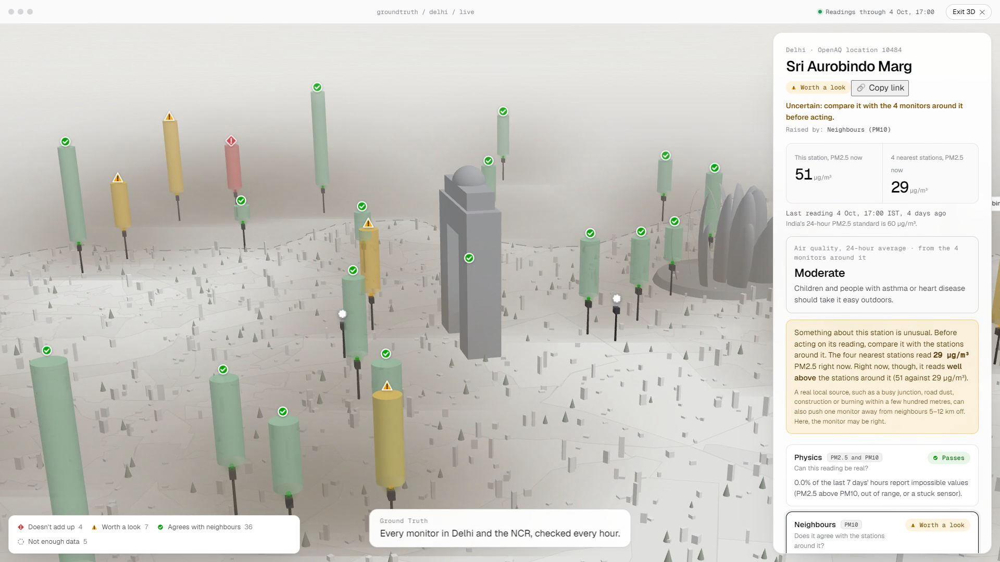
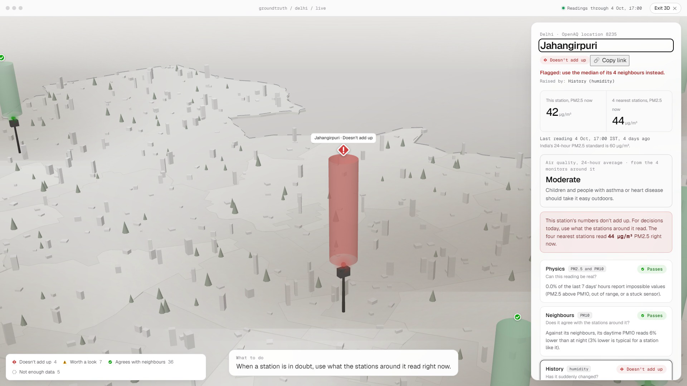
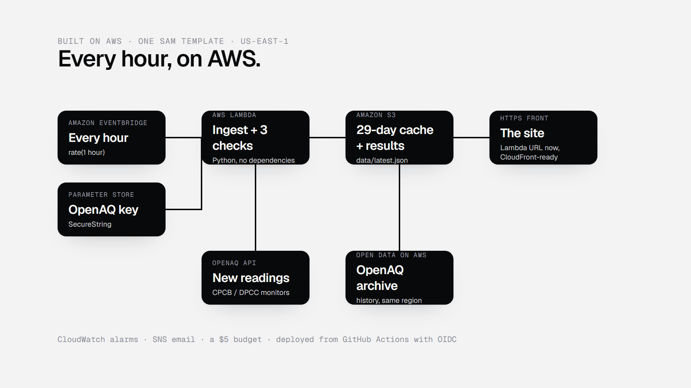

# Which of Delhi's air-quality numbers can you trust?

_For AWS Builder Center. Numbers as of 9 Oct 2026 from `docs/VALIDATION.md` and the live site; the three pictures are in `docs/img/`. When publishing: paste the text, upload the three PNGs where the image lines are, and put the post's URL in `docs/submission.md` and the README._

Every winter, Delhi plans around a number. Schools move assembly indoors when the AQI crosses a line, construction stops, parents keep children home. That number comes from about 40 monitors across the city, and nobody checks the monitors.

In October 2025, water tankers were filmed near one of them. That made us ask a simpler question than "is someone gaming the monitors?": can a person tell, from the published number, whether the monitor behind it is working at all? The answer was no. So for Environmental Hacks we built Ground Truth, which checks every monitor in Delhi and the NCR every hour and gives a plain answer.

## Start with the data, not the idea

Before writing any product code, we spent the first hours on one question: is the data good enough? The public OpenAQ archive, which sits on the Registry of Open Data on AWS, has 52 monitors in the Delhi box at 15-minute resolution. October-November 2025 was 99% complete.

Then we tested the idea we had walked in with. If a monitor is being sprayed with water from 11 in the morning to 5 in the afternoon, its dust reading should fall against its neighbours in those hours while its traffic gases don't. We wrote the method down before looking at the two monitors named in the news, then ran it.

They didn't stand out. Anand Vihar ranked 6th and Jahangirpuri 13th of 38. Anand Vihar does show a clean daytime dip, but every polluted hotspot does: by day the air mixes higher, so a monitor that reads high at night drifts towards its neighbours. Across all monitors, that effect alone explained most of the dip (a correlation of −0.72).

That changed the product. We stopped trying to detect spraying, and built something that finds monitors whose numbers don't add up and shows the evidence.

## Three questions, every hour

- **Physics:** can the reading be real? Fine dust (PM2.5) is part of all dust (PM10), so it can never be bigger. In Oct-Nov 2025, one Gurugram monitor broke that rule in 31% of hours.
- **Neighbours:** does it agree, hour by hour, with the four nearest monitors? We correct for daytime mixing with a robust line fitted across the whole city.
- **History:** has it suddenly changed against its own last three weeks?

When a monitor is in doubt, the site shows what its four neighbours read right now. That is the number a principal can actually use.

We also scored every day of October and November 2025 the way the live site would have. On an ordinary day, about 21 in 100 judged monitors got "doesn't add up" and 27 in 100 "worth a look". Most flags came from the physics check, 7.6 a day: readings that cannot be real, whatever the air is doing. The neighbours and history checks raised 2.9 flags a day between them.

## How do you know it works?

We tried to fool it. In real November 2025 data we lowered one quiet monitor's daytime dust by 40%, one monitor at a time. It caught all 30. It also wrongly flagged three other monitors across all 30 runs, and that number is how we found and fixed the hardest bug.

At first, one doctored monitor dragged its neighbours with it, because it sat inside their reference. The fix was a second pass: monitors flagged in the first pass are left out of everyone else's reference in the second. That test, and 68 others, runs on every change. A planted 30% drop was caught 29 times out of 30, and a 20% drop 10 times out of 30: we say how far the method reaches, not just where it works.

## On AWS

The whole thing is one SAM template in us-east-1, next to the archive it reads.

- EventBridge triggers a Python Lambda every hour.
- The Lambda reads new readings from the OpenAQ API (with the key in Parameter Store), runs the checks, and writes JSON to S3.
- The site is served from that bucket over HTTPS. CloudFront is in the template, but a new account can't create distributions until AWS Support verifies it, so a second small Lambda behind a function URL serves the bucket with the same security headers until then.
- CloudWatch alarms and a $5 budget email us if a run fails, if the data goes stale, or if the bill moves. A merge to main deploys through GitHub Actions with OIDC; no AWS keys are stored anywhere.
- Running it costs cents: about 720 Lambda runs a month, 10 MB in S3, and metrics and alarms inside the free tier.

Three things fought back:
1. **The archive runs about four days behind,** so live hours come from the API.
2. **CloudFront was off for our account** until verified, which cost a rolled-back first deploy and taught us that a function URL plus the right headers is a fine HTTPS front for a small site.
3. **The API averages over UTC hours.** India is UTC+5:30, so its "hours" run 13:30 to 14:30. Mixing those with archive hours would have shifted our 11-to-5 window by half an hour for live data only. We group the raw 15-minute readings into Indian hours ourselves.

## What we learned

- Test the idea against the data before building the product. Ours didn't survive, and the product got better.
- A tool that refuses to over-claim is more convincing than one that accuses.
- Show where every number comes from and how fresh it is.

Ground Truth is live at https://zsx5rsh4vklo266budro23qama0cpbpi.lambda-url.us-east-1.on.aws/ and open source: https://github.com/thegoodengineers/ground-truth
