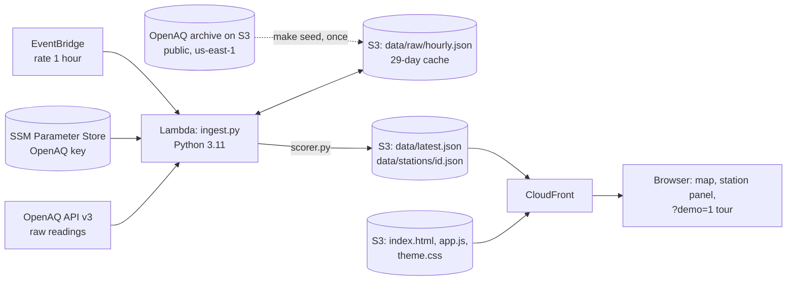

# Plan

**Ground Truth: which of Delhi's air-quality numbers can you trust?** Every monitor checked against its neighbours, its own history and its own physics. Environmental Hacks 2026 (WeMakeDevs × AWS), Air track. Submission Sunday 11 Oct 2026 (exact hour not yet published).

## Pitch

**One person, one pain:** a parent or a school principal in Delhi checks the AQI for the station nearest them before deciding on outdoor assembly or a morning walk. They have no way to know whether that station is working, broken or being gamed.

**What changes for them:** Ground Truth tells them, in plain words, whether that station agrees with the stations around it. When it doesn't, it shows what the 4 nearest stations read right now, so they have a number they can act on.

**Wow number (measured):** we planted a 40% daytime PM10 drop in real data and it was caught at **30 of 30** stations, with 3 knock-on flags across all 30 runs (`docs/LEARNINGS.md`). The impact number: in Oct-Nov 2025, Vikas Sadan reported more PM2.5 than PM10, which is impossible, in **31% of hours**.

**The 30-second demo moment:** click Anand Vihar. The hour-of-day chart shows its PM10 dropping against its neighbours between 11 and 5. Then the honest turn: "that looks like spraying, but every hotspot does it, and it didn't change after the video, so we don't flag it." Judges remember a tool that refuses to over-claim.

## Rubric (from wemakedevs.org/aws/env; marks per line are not published)

| Criterion | What judges look for | What we must SHOW |
|---|---|---|
| **Idea and Impact** | "Does it fix a real environmental problem? And what changes for the people living with it?" | The landing hero names the person and the decision. Each station panel ends in "use this number instead" when a station is in doubt. The video opens on a decision (assembly outdoors?), not on a map. |
| **Built on AWS** | AWS services or AWS open source; mandatory for prizes. The video has to show it. | EventBridge -> Lambda -> S3 -> CloudFront, SSM for the key, deployed with SAM. A 15 s console clip (#4) in the video, the architecture scene naming each service, `template.yaml` in the repo. |
| **Design and usability** | "Would someone who isn't on your team know what to do with it?" | Plain-language statuses ("agrees with neighbours", "worth a look", "doesn't add up"). One click to the evidence. Works on a phone. A "How it works / limits" section. Screenshots at 1440/1024/400 px reviewed before the video. |
| **The execution** | "Does it work? One feature that runs beats five that almost do." | The live URL with data less than 2 hours old. `make test`: 62 tests incl. the planted anomaly, green in CI. The `?demo=1` tour plays without setup. |
| **The demo video** | 3 minutes max, YouTube, shows what it does, who it's for, where AWS fits. | `video/script.md` follows hook -> problem -> name -> demo -> proof -> architecture -> lessons -> close. Generated by code (narration + scenes + capture), never sped up. |

Hidden expectations from the rules: the repo history must match the event dates (it does: every commit is 8 Oct or later); every third-party asset needs a credit and licence; the writeup covers the problem, the build and where AWS fits; a Builder Center blog enters the "top 5 blogs" prize.

## What the spike taught us (see `spike/RESULTS.md`)

- The data is solid. The public OpenAQ archive has 52 stations in the Delhi box at 15-minute resolution, Oct-Nov 2025 is 99% complete, and no credentials are needed.
- We **cannot** claim to detect spraying. On a method fixed in advance, Anand Vihar ranks 6th and Jahangirpuri 13th of 38. So the product is an *anomaly finder that shows its evidence*, never an accusation.
- The physics checks are cheap and they fire. 1,044 of 66,831 station-hours have PM2.5 above PM10, which is physically impossible. Three stations do it more than 5% of the time (Vikas Sadan 31%, Arya Nagar 14%, Gwal Pahari 7%), and the same two have about 700 stuck or zero hours each.
- The neighbour chart is the clearest picture we have. Anand Vihar's PM10 sits 29% above its neighbours at night and only 9% above them at 11:00-16:00. Whatever the cause, a viewer gets that in one glance.

## The three checks (each station gets ok / watch / flag per check)

| Check | Question | Rule (v1) |
|---|---|---|
| **Physics** | Can this reading be real? | PM2.5 > 1.05 × PM10, values out of range, or 3+ identical hours in a row. Flag if >5% of the last 7 days' hours fail; watch if >1%. |
| **Neighbours** | Does it agree with stations around it? | Log gap against the median of its nearest 4 within 12 km (co-located twins skipped). Last 7 days' daytime (11-17) minus night (22-06) PM10 contrast, corrected for daytime mixing with a city-wide Theil-Sen line against the night gap, as a robust z across stations. Watch at \|z\| ≥ 2, flag at ≥ 3. |
| **History** | Has it changed against itself? | The same contrast for PM10 and humidity: the last 7 days against the 21 before, in robust SDs of the station's own day-to-day spread. Watch at 2, flag at 3. |

Scoring runs twice. Stations flagged on neighbours or history in the first pass are left out of everyone else's reference in the second, so one misbehaving station doesn't drag its neighbours with it.

The headline status is the worst of the three. Copy says "doesn't agree with its neighbours" and never "fake" or "tampered".

## Architecture

The archive runs about 4 days behind (on 8 Oct the latest file was 4 Oct), so the live hours come from the API while the history is seeded from the archive. The ingest groups the API's raw readings into IST hours with the same code as the backfill, because the API's own hourly averages run on UTC hours, half an hour off.

## Risks and mitigations

| Risk | Mitigation |
|---|---|
| The AWS account or CloudFront isn't ready in time (#1, #2) | The site runs from `make local` with real sample data, and `?demo=1` needs no backend, so the video can be recorded regardless. Fallback hosting: the S3 website endpoint. |
| OpenAQ API rate limit or schema surprise on the first live run | Calls are paced and budgeted (`MAX_CALLS`); `overlap_ratio` checks units against the archive; the archive-seeded cache keeps the site useful even if live hours lag. |
| The tool reads as an accusation | Copy rules plus a test (`test_copy_never_accuses`); a limits section on the site; the honest Anand Vihar result in the video. |
| Design and video lose points again (as at First Commit) | The site is built against real data; UI rounds with screenshots on Friday. The video script is written now; the video itself is made on Sunday from that script with the code pipeline, so it takes hours, not a day. |
| Bhumika can't push (read-only access) | Raise her to Write; until then she works from a fork. |

## Timeline

| When | Goal | Owner |
|---|---|---|
| **Thu 8 Oct** | Done: spike, plan, scorer + tests, ingest Lambda, SAM template, site (light design, `?demo=1`), video script. To do: AWS account + key (#1), first deploy (#2). | All |
| **Fri 9 Oct** | Live hourly data (#3, `make seed && make run`). UI polish rounds with screenshots at 1440/1024/400. README for judges. | Abhijeet, Bhumika, Chirag |
| **Sat 10 Oct** | UI freeze 14:00 IST. Console clip (#4). Writeup and blog drafted. | All |
| **Sun 11 Oct** | Video day: build the scenes, record the `?demo=1` capture, narrate, assemble, upload to YouTube (unlisted). Then submit, at least 1 hour before the deadline, and check every link in a signed-out browser. | All |

## Out of scope

Claims about spraying, cities other than Delhi, alerts and notifications, user accounts, forecasting, any ML model.

## How we'll know it worked

- A judge opens the URL, sees the map in under 2 seconds, clicks Vikas Sadan and understands why it's flagged without reading docs.
- The data is less than 2 hours old during judging.
- `pytest` passes, including a planted-anomaly test: inject a daytime PM10 drop at one station and the neighbour and history checks flag it, while the untouched stations stay ok.
- The video is under 3 minutes, shows the real console, and states the limits honestly.
